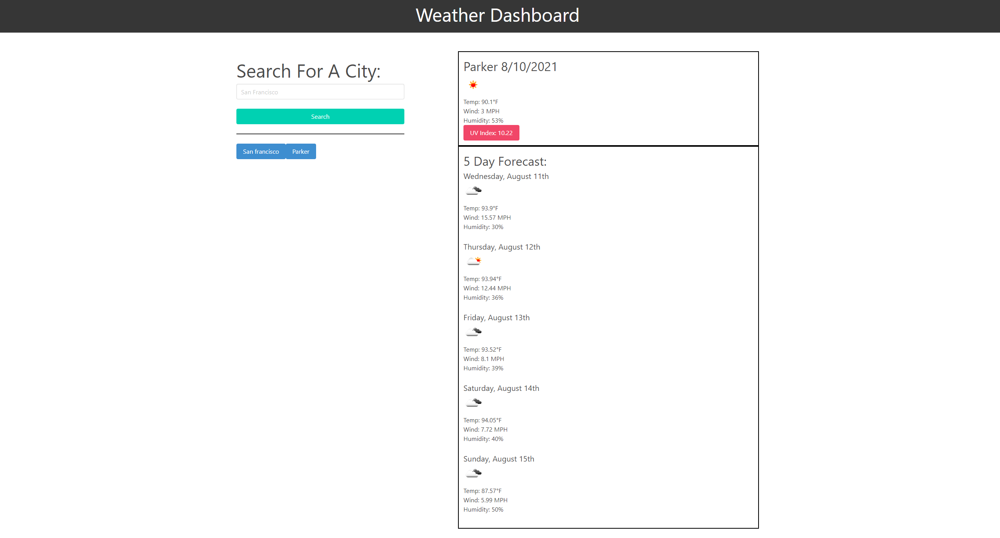

# Weather-Dashboard

This project uses Jquery, Bulma, Moment.js along with HTML, CSS, and vanilla JS to create a weather dashboard. You can type a city in the search field to pull up current weather conditions and a five day forecast. Your searches will be saved in local storage so you can click on them again to look at that cities weather again.

Check it out here: https://nickwojt.github.io/weather-dashboard/

